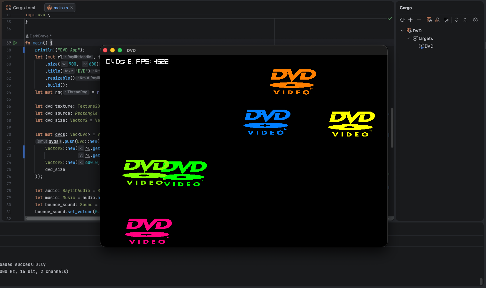

TLDR; I made the DVD bouncing logo in a lot of ways because I was bored ([GitHub](https://github.com/darkbrave/raylibrust-dvd))

## Story

About five years ago I was goofing around in Scratch while bored, and ended up making a lot of weird projects, one of which was a [bouncing DVD screensaver logo](https://scratch.mit.edu/projects/572030152/) with some not original music/SFX. Why? Why not! And that was (and still is) kind of my philosophy for these sorts of things.

Now in the present day, I have a friend who does a lot of programming, but for me programming is more the sort of thing I do only when I have to. But since I'm on summer break with nothing better to do, I felt like I should brush up on my experience a little bit, so after a bit of review of Java to reinforce some OOP concepts, I decided to jump to C++.

I've always heard C++ is one of the most difficult languages, so while I knew basic things like pointers and the std::cout/cin bitshift operator overload were weird, I truly had no idea what I was getting myself into. I was able to easily write a basic procedural version of the DVD bouncing in C++ with Raylib, which I found to just be a solid (but easy) library to use, and even add some fun features like adding more DVDs and bounce sound effects. All this really helped me understand those concepts (like how to use pointers and make memory-safe code).

Of course my sneaky Java OOP-brained mind decided to make an entire lightweight "game engine wrapper" in C++ Raylib, which if you know anything about any of those words is just kind of a stupid idea. While the code ballooned in size, and I was able to get it to work, writing objects within my lifecycle system while also referencing back to the core assets was not only a spaghetti-code nightmare, but also had so many stupid C++ decisions I can't even begin to decipher. Think "aimlessly passing around pointers that really didn't need to exist and that likely cause memory leaks". Basically I learned that C++ has 5,000 ways to do one thing, and each of them has major tradeoffs in readability, efficiency, and complexity.

I then realized Raylib, being a C library, had Rust bindings, so I got my Cargo environment set up, and ported over the basis of the app. As with all beginners, the borrow checker was my enemy, but once you get used to it, it's really nice to know that it prevents me from making all manner of stupid decisions. While things like anonymous functions and custom types are a bit weird compared to other languages, there's also a lot of "why does no other language do this" things, especially with the numerical primitives (so nice compared to C++) and mutability of data.

In the middle of the Rust Raylib version, I did try out Macroquad, but given some issues like a weird 60Hz frame cap on my computer and the lack control over window resizing events, I decided to migrate back for now.

Oh yeah, also I ported it to plain-old C (literally copy-pasted the basic Rust version and adjusted the syntax) just for fun, but given there's bindings in every language, maybe someday I'll have to expand, while using the DVD logo to find my favorite one.

I generally think taking a simple concept, like this DVD logo, and adding just a stupid amount of features like spamming thousands of DVDs, randomizing positions/speed, changing hue on bounces, fancy music/SFX, and more can just be a whole lot of fun. Who knows? Maybe I'll make a worthwhile downloading app someday.

## Demo

I'll do this tomorrow lol.

## Code

Here's links to the GitHub repositories with the "main" versions I worked on.

- [C++ Raylib (OOP weirdness)](https://github.com/DarkBrave/raylibcpp-dvd)
- [Rust Raylib (fullest)](https://github.com/DarkBrave/raylibrust-dvd)
- [Rust Macroquad (bare-bones)](https://github.com/DarkBrave/raylibrust-dvd/tree/macroquad)
- [C Raylib (bare-bones)](https://github.com/DarkBrave/raylibc-dvd)

I've embedded the latest code for the Raylib in Rust version (that has the most features) below for reference:



Oh yeah, here's the Scratch version for those of you interested in it.

